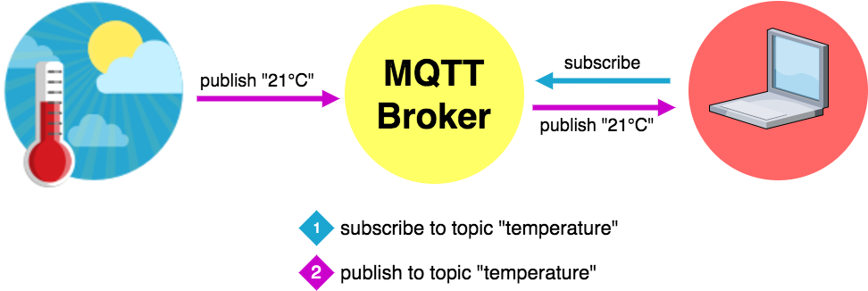

theme: Poster, 7
footer: @stephaniecodes

# Haute Codeture

#     

### Stephanie Nemeth

#### @stephaniecodes

[.hide-footer]

---

# Hi, I'm Stephanie.

* Frontend Developer @ [Werkspot](https://werkspot.nl)

- Organizer of [Stupid Hackathon Amsterdam](http://www.stupidhackathon.wtf)

---

## I like building beautiful, useless things.

^ What does that even mean? I've only been working on hardware for a year.

---

### I got inspired at an art museum.

#                               

---

### Jean Tinguely

#                                 

^- Jean Tinguely
^- Swiss, 60s/70s
^- Art NOT about standing in a sterile white space, distantly gazing silent painting
^- Art meant to be playful
^- He made machines produce art themselves
^- Large installations meant to be triggered by a viewer
^- Interested in making art interactive w/ viewer
^- Therefore Blurring line artist/viewer

---

> I wanted something ephemeral that would pass like a falling star...The work had to just transpire, make people dream and talk, and that would be all.
> -- Jean Tinguely

^- When I was at the exhibit, this quote stood out to me.
^- Really liked idea of a temporary experience that connects artist and viewer
^-It's spontaneous and,
^- Only meant to bring joy
^- Inspire for short time

---

# My first project

---

# My first project

---

# Creating art with a raspberry pi

🎨 [https://light-art.herokuapp.com](https://light-art.herokuapp.com)

📓 [https://stephanie.lol/codeland](https://stephanie.lol/codeland)

📹 [https://goo.gl/mK5afh](https://www.youtube.com/watch?v=eud6LnzVISM)

^Inspired by the reaction to my pixel art project
^Take the experience out of my living room

---

## What if

## I made my clothing

## the canvas?

^Taking this same idea and transferring it to my clothing

---

---

---

# Pics of umbrella/skirt/necklace

---

# First big **Arduino** project

---

# Faced lots of challenges

---

## _*Building stuff is all about*_ iteration

---

## So, let's take a journey

---

# Project Plan:

* Web app for user input
* LEDs + battery + microcontroller in clothing
* Way to relay message from app to clothing

[.build-lists: true]

---

# Web App

* Plain ol' HTML5 + JavaScript page

[.build-lists: true]

---

# Hardware

* Beginner friendly
* Small footprint
* Durability
* Wifi connectivity

[.build-lists: true]

^Must be as discrete as possible in my clothing

---

# Adafruit Feather Huzzah ESP8266

* Small
* Wifi built-in
* Lots of info/tutorials

[.build-lists: true]

---

[.build-lists: true]

# Talk to my clothes

## Socket.IO

* Used it in my Raspberry Pi art project
* Already knew that it works
* Easy setup: node.js server & client libraries

^Communicate from web app to several pieces of hardware at once

---

---

# Iteration #1

Build/wiring montage

SO MUCH WORK

---

# Iteration #1

Coding Arduino

setup + loop

---

# First Outing: Lighted Bike Ride Amsterdam

^FAIL

---

# Fail

^Embarrassed, disappointed

---

# Iteration #2

### (Or, how to make it crash less)

---

# Figure out where it was crashing

* Use Serial Monitor in Arduino IDE (Log statements)

---

# Figure out where it was crashing

* Use Serial Monitor in Arduino IDE (Log statements)

---

## Flaky connection

#  

# 😢

---

### _Socket.IO is_ great _for the web!_

### _but is the_ best _fit for my IoT Project?_

^Geared for browsers, but I didn't need that extra overhead

---

### Just because a library is available, doesn't mean it's the best solution

^So i took a step back and thought again about what i was up against coding for hardware.

---

[.build-lists: true]

# Coding for Hardware

* Resources are at a premium
* Optimize for efficiency
* Minimize overhead

^Not communicating between browser and server for my hardware, so that extra overhead for HTTP isn't needed.

---

## What else can I use?

#            

---

## What else can I use?

#  

## ✨ MQTT ✨

^Not communicating between browser and server for my hardware, so that overhead isn't needed.

---

[.build-lists: true]

# MQTT

* Developed in 1999
* Connect remote oil pipelines over satellite connection

^Born in 1999, where needed a solution that allowed for minimal battery loss and minimal bandwidth connecting oil pipelines over satellite connection.

---

[.build-lists: true]

# MQTT

* Simple
* Lightweight
* Reliable
* Open

^Born in 1999, where needed a solution that allowed for minimal battery loss and minimal bandwidth connecting oil pipelines over satellite connection.

---

# Publish/subscribe

^The MQTT messages are delivered asynchronously (“push”) through the publish subscribe architecture. Clients connect to this broker, which then mediates communication between the two devices. Each device can subscribe, or register, to particular topics. When another client publishes a message on a subscribed topic, the broker forwards the message to any client that has subscribed.
^Space decoupling: Publisher and subscriber do not need to know each other
^Time decoupling: Publisher and subscriber do not need to run at the same time.
^Synchronization decoupling: Operations on both components are not halted during publish or receiving

---

[.hide-footer]

---

[.build-lists: true]

# Lightweight

* Transport over TCP/IP
* Low overhead (2 bytes minimum) 😯

^MQTT control packet headers are kept as small as possible. Each control packet has a specific purpose and every bit in the packet is carefully crafted to reduce the data transmitted over the network. Each MQTT control packet consist of three parts, a fixed header, variable header and payload. Each MQTT control packet has a 2 byte Fixed header. Not all the control packet have the variable headers and payload. A variable header contains the packet identifier if used by the control packet. A payload up to 256 MB could be attached in the packets. Having a small header overhead makes this protocol appropriate for IoT by lowering the amount of data transmitted over constrained networks.

---

[.build-lists: true]

# Reliable

* Quality of Service (QoS) levels
* Offline messaging
* Retained messages

^QoS: agreement between sender and receiver of a message regarding the guarantees of delivering a message (At most once, at least once, exactly once)
^QoS is a major feature of MQTT, it makes communication in unreliable networks a lot easier because the protocol handles retransmission and guarantees the delivery of the message, regardless how unreliable the underlying transport is
^Hook up a DB: Persistent session means even if the client is offline all the above will be stored by the broker and are available right after the client reconnects.

---

# Open

* Open and standardized protocol
* Clients/brokers for all kinds of implementations

---

[.build-lists: true]

# Iteration #2

Implement my own broker?

* Can't access MQTT port 1883 on Heroku
* But, not ready to move services yet

---

[.build-lists: true]

# shiftr.io

IoT prototyping platform

* Free
* Easy setup

---

# Iteration #2

draw.io diagram

---

# Iteration #2

Relying on 3rd party service, meh

---

# Iteration #3

buid my own broker

---

# Iteration #3

Devops hell

---

# Iteration #3

* building the broker
* deploying on digital ocean

---

# Iteration #4

* new microcontroller

---

# Demo time

---

# Thank you!

(Now go create something wonderful!)

🦄✌️✨

[https://stephanie.lol](https://stephanie.lol)

[@stephanicodes](https://twitter.com/stephaniecodes)
