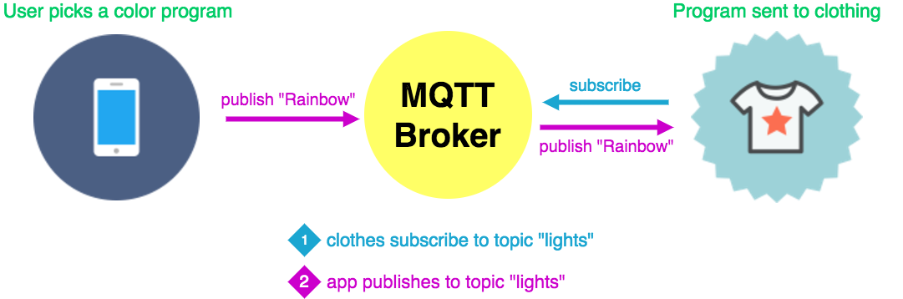

theme: Poster, 7
footer: @stephaniecodes

# Haute Codeture

# <br><br><br><br>

### Stephanie Nemeth

#### @stephaniecodes

[.hide-footer]

---

# Hi, I'm Stephanie.

* Frontend Developer @ [Werkspot](https://werkspot.nl)

- Organizer of [Stupid Hackathon Amsterdam](http://www.stupidhackathon.wtf)<br><br><br>

^I live in Amsterdam.

^Dev for a total 3 years, last yr as a frontend/js dev

^Frontend dev @ werkspot

^Organizer of Stupid Hackathon Amsterdam

---

## I like building<br>useless (but joyful) things.

^only been working with hardware for the past year.

^And I didn't get into hardware cuz I had a project in mind to automate some part of my life or even cuz I saw something cool someone made on twitter.

---

### I got inspired at an art museum.

#<br><br><br><br><br><br><br><br><br><br><br><br><br><br><br><br><br><br><br><br><br><br><br><br><br><br><br><br><br><br><br>


^I got into hardware cuz I got inspire by a visit to an art museum.

^Stedelijk museum in Amsterdam

^I went to see an exhibition of art by Jean Tinguely.

---

### Jean Tinguely

#<br><br><br><br><br><br><br><br><br><br><br><br><br><br><br><br><br><br><br><br><br><br><br><br><br><br><br><br><br><br><br><br><br>


^ Jean Tinguely

^ Swiss, 60s/70s

^ Art NOT about standing in a sterile white space, distantly gazing silent painting

^ Art meant to be playful

^ He made machines produce art themselves

^ Large installations meant to be triggered by a viewer

^ Interested in making art interactive w/ viewer

^ Therefore Blurring line artist/viewer

---

> I wanted something ephemeral that would pass like a falling star...The work had to just transpire, make people dream and talk, and that would be all.
> -- Jean Tinguely

^ When I was at the exhibit, this quote stood out to me.

^ Really liked idea of a temporary experience that connects artist and viewer

^ It's spontaneous and,

^ Only meant to bring joy

^ Inspire for short time

---

# My first project


^I was inspired by the exhibit

^ I decided to tackle a hardware project for 1st time

^Person creates a pixel art design on a web app

^Sends it to my raspberry pi

^Shows up on my rpi in my living room

---

# My first project


^React app, socketio server, rpi

^Users create pixel art designs on the react web app

^Sent to the socketio server deployed on heroku

^then sent to raspberry pi and shows up on my pi in my living room!

---

# Creating art with a raspberry pi

🎨 [light-art.herokuapp.com](https://light-art.herokuapp.com)

📹 [goo.gl/mK5afh](https://www.youtube.com/watch?v=eud6LnzVISM)

^I gave my first conf talk last year about this project.

^You can check out the project or video.

^Really inspired by the reaction to my pixel art project

^Started thinking how I can take the experience out of my living room.

---

## What if

## I made my clothing

## the canvas?

^Taking this same idea and transferring it to my clothing

---


^User picks a program

^Send that info to a server

^that sends it to arduino and leds in my clothing

---


^describe video

---


# First big **Arduino** project

---


# Faced lots of challenges

---

## _*Building stuff is all about*_ iteration

---

# Project Plan:

* Web app for user input
* LEDs + microcontroller in clothing
* Relay messages from app to clothing

^Create web app for users

^Integrate LEDS and microcontroller into clothing pieces

^and a way to send programs from web to clothing

---

[.build-lists: true]

# Hardware

* Beginner friendly
* Small footprint
* Durability
* Wifi connectivity

^Must be as discrete/small as possible in my clothing

---

[.build-lists: true]


# Adafruit Feather Huzzah ESP8266

* Small
* Wifi built-in
* Lots of info/tutorials

^I chose this arduino.

^it's small, has built-in wifi

^very popular microchip so lots of info online

---

[.build-lists: true]

# Talk to my clothes

## Socket.IO

* Used it in my Raspberry Pi art project
* Already knew that it works
* Easy setup: node.js server & client libraries

^I knew it worked well for my rpi pixel art

^Communicate from web app to several pieces of hardware at once

---


---

# Build process


^So, the build process:

^Basically me sitting on the floor in my living room of my tiny amsterdam apartment, and constructing each piece, testing, and fixing soldering mistakes lol

---

# First Outing: Lighted Bike Ride Amsterdam


^So excited to take it out in public!

^But super FAIL

---

# Fail


^Embarrassed, disappointed

---

# Iteration #2

### (Or, how to make it crash less)

^An opportunity to troubleshoot and make it work better

---

# Figure out where it was crashing

* Use Serial Monitor in Arduino IDE (Log statements)


^Lucky for me, the microcontroller i chose supports monitoring when plugged into my computer

^put in log statements at all diff bits of the code

---

# Figure out where it was crashing

* Use Serial Monitor in Arduino IDE (Log statements)


^very clear was crashing cuz the internet was disconnecting and reconnecting over and over again

---

## Flaky connection

# <br>

# 🤔

^got me thinking...

---

### _Socket.IO is_ great _for the web!_

### _but is the_ best _fit for my IoT Project?_

^Made for web applications communicated over HTTP

^Geared for browsers, but I didn't need that extra overhead

---

### Just because a library is available, doesn't mean it's the best solution

^So i took a step back and thought again about what i was up against coding for hardware.

---

# Coding for Hardware

* Resources are at a premium
* Minimize overhead

^Not communicating between browser and server for my hardware, so that extra overhead for HTTP isn't needed.

---

## What else can I use?

# <br><br><br><br><br><br><br><br><br><br><br>

---

## What else can I use?

# <br>

## ✨ MQTT ✨

^M2M/IoT connectivity protocol

---

# MQTT

A lightweight messaging protocol optimized for high-latency or unreliable networks

^Born in 1999, where needed a solution that allowed for minimal battery loss and minimal bandwidth connecting oil pipelines over satellite connection.

---

# Publish/subscribe



^Consists of clients and a broker.

^Clients connect to the broker, which then mediates communication between the two devices.

^Each device can subscribe, or register, to particular topics.

^When another client publishes a message on a subscribed topic, the broker forwards the message to any client that has subscribed.

^Publisher and subscriber do not need to know each other

^Publisher and subscriber do not need to run at the same time.

^Operations on both components are not halted during publish or receiving

---

# Lightweight

* Transport over TCP/IP
* 2 byte overhead

^MQTT control packet headers are kept as small as possible.

^Having a small header overhead makes this protocol appropriate for IoT by lowering the amount of data transmitted over constrained networks.

^Each control packet has a specific purpose and every bit in the packet is carefully crafted to reduce the data transmitted over the network.

^It means that in comparison with many other protocols (HTTP) it almost does not load the network with the transfer of information, which is necessary only for the functioning of the protocol.

---

# Flexible

* Data agnostic payload

^Send binary, jpgs, etc

---

# Reliable

* Offline Messaging<br/>

^Hook up a DB: Persistent session means even if the client is offline all the above will be stored by the broker and are available right after the client reconnects.

---

# Reliable

[^*]

[^*]: [http://internetofthingsagenda.techtarget.com/definition/MQTT-MQ-Telemetry-Transport](http://internetofthingsagenda.techtarget.com/definition/MQTT-MQ-Telemetry-Transport)

^QoS: agreement between sender and receiver of a message regarding the guarantees of delivering a message

^QoS is a major feature of MQTT, it makes communication in unreliable networks a lot easier because the protocol handles retransmission and guarantees the delivery of the message, regardless how unreliable the underlying transport is

^3 Levels: At most once, at least once, exactly once

---


^MQTT has pretty short specification.

^ Simple verbs used to describe actions:

^eg CONNECT, PUBLISH, SUBSCRIBE, UNSUBSCRIBE and DISCONNECT types that are significant for developers.

---


^So I was sold!

---

# Setup MQTT Client + Broker


---

# Setup Web App Client


---


^yay can use MQTT in the browser!

^MQTT.js is a client library for the MQTT protocol, written in JavaScript for node.js and the browser.

---

# MQTT.js Client

```javascript
var mqtt = require("mqtt");
// Create a client that connects to the broker
var client = mqtt.connect(MQTT_BROKER_URL);

function sendEvent(program) {
  // Publish topic: "lights", payload: "rainbow"
  client.publish("lights", program);
}

var rainbowButton = document.getElementById("rainbowButton");
rainbowButton.addEventListener("click", () => sendEvent("rainbow"));
```

^Easy to follow

^Only a couple lines of code to implement.

^Include the library

^Create a client that connects to wherever url the mqtt broker is located

^Whenever the rainbowButton is clicked, sends the program "rainbow" to the broker

---

# Setup Arduino Clients


---

# Arduino-MQTT Client

```c
#include <MQTTClient.h>

WiFiClient net;
MQTTClient client;

void setup() {
  WiFi.begin(SSID, PW);
  // Connect to broker, subscribe to topic "lights"
  client.begin(MQTT_BROKER_URL, net);
  client.connect("necklace", KEY, TOKEN);
  client.subscribe("lights");

  // Called when message received
  client.onMessage(messageReceived);
}

void loop() {
  // Sends/receives messages
  client.loop();
}
```

^Easy to follow even if you aren't familiar with coding for arduino!

^Only a couple lines of code to implement.

^Include the library

^Connect client to mqtt broker thru the url

^Subscribes to topic "lights"

^Whenever message is received, onMessage method is called.

---

# Setup MQTT Broker


^Everything going really smoothly, setting up the broker should be easy too right?

---

# MQTT Broker

* Couldn't create my own on Heroku (ports not accessible)
* But... not ready to move services and do devops stuff yet 😮

^ Minor hiccup... but looked for a Broker as a service instead

---

# shiftr.io

IoT prototyping platform

* Free
* Easy setup

^Sign up and get a key/token and ready to roll

^Also doesn't seem to be a limitation on # of messages per min

---


^Look it's my setup

^And it worked great!

---


^I was happy but I wasn't ecstatic.

---

### Relying on a small external broker service...

### **not optimal**

^Too many unknowns: great for prototyping but relying on for my whole project, too risky.

^So you can guess what I probably did next...

---

# Iteration #3

### Build my own MQTT broker!

^Built my own mqtt broker

---

# Build a MQTT Broker

* Need access to port 1883
* Heroku → Digital Ocean

^Like I mentioned before, I had deployed my app on heroku but unfortunately could access the ports I needed

^Decided to try my luck at configuring/deploying it on digital ocean since i could access ports i need there.

---

# Build a MQTT Broker


^Embed MQTT Broker in Express server

^Final configuration

---

# MQTT Broker: AEDES


[https://github.com/mcollina/aedes](https://github.com/mcollina/aedes)

^To implement the MQTT broker, used this library

^broker is embeddable in my current express server, minimal configuration change

---

IMPLEMENT THE MQTT BROKER

```javascript
const express = require("express");
const app = express();
const path = require("path");
const aedes = require("aedes")();
// Create MQTT server for MQTT connections
const mqttServer = require("net").createServer(aedes.handle);
// Create HTTP server for website requests
const httpServer = require("http").createServer(app);
const ws = require("websocket-stream");
const mqttPort = 1883;
const appPort = 8080;

mqttServer.listen(mqttPort, function() {});
httpServer.listen(appPort, function() {});

// Augment the HTTP server with MQTT-over-websocket capabilities
ws.createServer({ server: httpServer }, aedes.handle);
```

^Only a couple lines of code to implement.

^Include the library

^Create MQTT server & HTTP server

^Listen on the specified port

^Then addon so the HTTP server has MQTT over websocket capabilities so that it can handle MQTT connections from clients in the browser (our web app)

---


---

# Iteration #4

# <br><br><br><br><br><br>

^Awesome!

^I conquered my devops fears and it worked!

^I was done right?

---

# Iteration #4

#### (aka last thing I changed)

### Upgrade Microcontroller

^Nope, upgrade the hardware

---

[.build-lists: true]


## Adafruit Feather M0 WiFi

* Low power management
* Separate Wifi module
* High speed, reliable Wifi 🤩
* 2X cost of Feather Huzzah

^Doesn't have to yield to wifi core, steady wifi throughput

---

[.build-lists: true]

## What next?

* Feather M0 has full python interpreter onboard

* Rewrite Arduino/C++ code in CircuitPython!<br><br>

---


^Demo time!

---

# Final thoughts

^It can take many iterations to get something right

^Or where you want it to be and that's ok.

^I messed a bunch during this with trying to figure out devops

^and doing sloppy soldering,

^and it was super frustrating,

^but it all helped me learn and improve my skills.

^breaking stereotypes with strangers

---

# Thank you!

🦄✌☮️️✨

[stephanie.lol](https://stephanie.lol)

[@stephanicodes](https://twitter.com/stephaniecodes)
