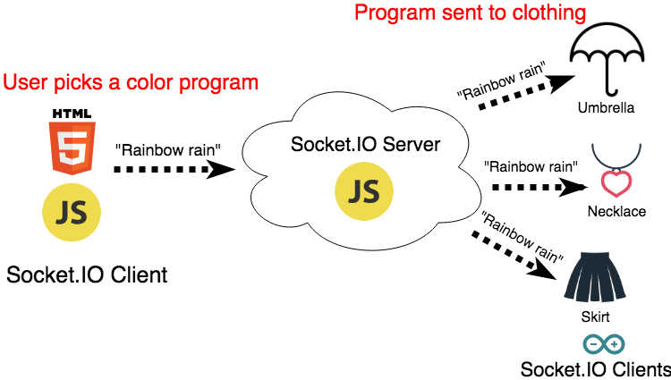

theme: Poster, 7
footer: @stephaniecodes

# Haute Codeture

#     

### Stephanie Nemeth

#### @stephaniecodes

[.hide-footer]

---

# Hi, I'm Stephanie.

* Frontend Developer @ [Werkspot](https://werkspot.nl)

- Organizer of [Stupid Hackathon Amsterdam](http://www.stupidhackathon.wtf)

---

## I like building beautiful, useless things.

^ What does that even mean? I've only been working on hardware for a year.

---

### I got inspired at an art museum.

#                               

---

### Jean Tinguely

#                                 

^- Jean Tinguely
^- Swiss, 60s/70s
^- Art NOT about standing in a sterile white space, distantly gazing silent painting
^- Art meant to be playful
^- He made machines produce art themselves
^- Large installations meant to be triggered by a viewer
^- Interested in making art interactive w/ viewer
^- Therefore Blurring line artist/viewer

---

> I wanted something ephemeral that would pass like a falling star...The work had to just transpire, make people dream and talk, and that would be all.
> -- Jean Tinguely

^- When I was at the exhibit, this quote stood out to me.
^- Really liked idea of a temporary experience that connects artist and viewer
^-It's spontaneous and,
^- Only meant to bring joy
^- Inspire for short time

---

# My first project

---

# My first project

---

# Creating art with a raspberry pi

🎨 [https://light-art.herokuapp.com](https://light-art.herokuapp.com)

📓 [https://stephanie.lol/codeland](https://stephanie.lol/codeland)

📹 [https://goo.gl/mK5afh](https://www.youtube.com/watch?v=eud6LnzVISM)

^Inspired by the reaction to my pixel art project
^Take the experience out of my living room

---

## What if

## I made my clothing

## the canvas?

^Taking this same idea and transferring it to my clothing

---

---

---

# Pics of umbrella/skirt/necklace

---

# First big **Arduino** project

---

# Faced lots of challenges

---

## _*Building stuff is all about*_ iteration

---

## So, let's take a journey

---

# Project Plan:

* Web app for user input
* LEDs + battery + microcontroller in clothing
* Way to relay message from app to clothing

[.build-lists: true]

---

# Web App

* Plain ol' HTML5 + JavaScript page

[.build-lists: true]

---

# Hardware

* Beginner friendly
* Small footprint
* Durability
* Wifi connectivity

[.build-lists: true]

^Must be as discrete as possible in my clothing

---

# Adafruit Feather Huzzah ESP8266

* Small
* Wifi built-in
* Lots of info/tutorials

[.build-lists: true]

---

[.build-lists: true]

# Talk to my clothes with Socket.IO

* Used it in my Raspberry Pi art project
* Already knew that it works
* Easy setup: node.js server & client libraries

^Communicate from web app to several pieces of hardware at once

---

---

# Iteration #1

Build/wiring montage

SO MUCH WORK

---

# Iteration #1

Coding Arduino

setup + loop

---

# First Outing: Lighted Bike Ride Amsterdam

^FAIL

---

# Fail

^Embarrassed, disappointed

---

# Iteration #2

How to make crash less

---

# Intro to MQTT

blah

---

# Intro to MQTT

blah

---

# Demo time

---

# Thank you!

(Now go create something wonderful!)

🦄✌️✨

[https://stephanie.lol](https://stephanie.lol)

[@stephanicodes](https://twitter.com/stephaniecodes)
