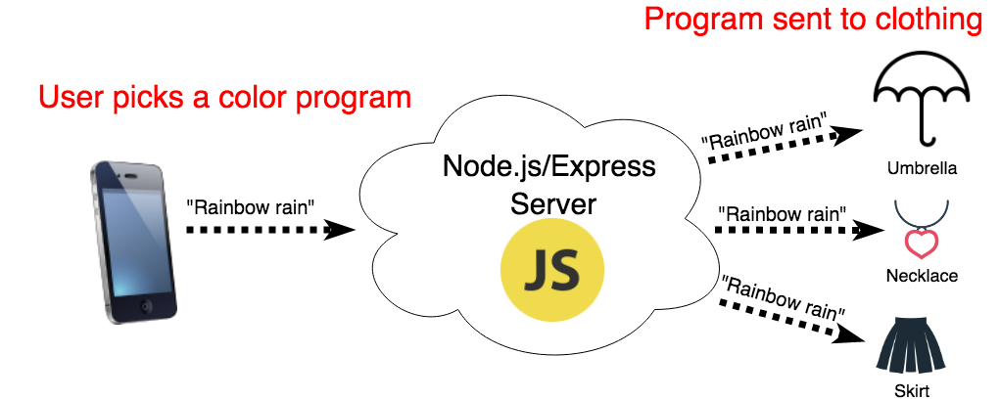
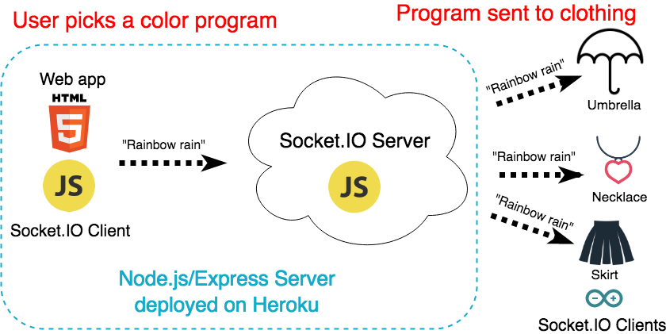

theme: Poster, 7
footer: @stephaniecodes

# Haute Codeture

# <br><br><br><br>

### Stephanie Nemeth

#### @stephaniecodes

[.hide-footer]

---

# Hi, I'm Stephanie.

* Frontend Developer @ [Werkspot](https://werkspot.nl)

- Organizer of [Stupid Hackathon Amsterdam](http://www.stupidhackathon.wtf)

^I live in Amsterdam.
^Dev for a total 3 years, last yr as a frontend/js dev
^Frontend dev @ werkspot
^Organizer of Stupid Hackathon Amsterdam

---

## I like building<br/>useless (but joyful) things.

^You should know, I've only been working with hardware for the past year.

---

### I got inspired at an art museum.

#<br><br><br><br><br><br><br><br><br><br><br><br><br><br><br><br><br><br><br><br><br><br><br><br><br><br><br><br><br><br><br>


---

### Jean Tinguely

#<br><br><br><br><br><br><br><br><br><br><br><br><br><br><br><br><br><br><br><br><br><br><br><br><br><br><br><br><br><br><br><br><br>


^- Jean Tinguely
^- Swiss, 60s/70s
^- Art NOT about standing in a sterile white space, distantly gazing silent painting
^- Art meant to be playful
^- He made machines produce art themselves
^- Large installations meant to be triggered by a viewer
^- Interested in making art interactive w/ viewer
^- Therefore Blurring line artist/viewer

---

> I wanted something ephemeral that would pass like a falling star...The work had to just transpire, make people dream and talk, and that would be all.
> -- Jean Tinguely

^- When I was at the exhibit, this quote stood out to me.
^- Really liked idea of a temporary experience that connects artist and viewer
^-It's spontaneous and,
^- Only meant to bring joy
^- Inspire for short time

---

# My first project


---

# My first project


---

# Creating art with a raspberry pi

🎨 [light-art.herokuapp.com](https://light-art.herokuapp.com)

📓 [stephanie.lol/codeland](https://stephanie.lol/codeland)

📹 [goo.gl/mK5afh](https://www.youtube.com/watch?v=eud6LnzVISM)

^Inspired by the reaction to my pixel art project
^Take the experience out of my living room

---

## What if

## I made my clothing

## the canvas?

^Taking this same idea and transferring it to my clothing

---



---


---


# First big **Arduino** project

---


# Faced lots of challenges

---

## _*Building stuff is all about*_ iteration

---

[.build-lists: true]

# Project Plan:

* Web app for user input
* LEDs + battery + microcontroller in clothing
* Way to relay message from app to clothing

---

[.build-lists: true]

# Hardware

* Beginner friendly
* Small footprint
* Durability
* Wifi connectivity

^Must be as discrete as possible in my clothing

---

[.build-lists: true]


# Adafruit Feather Huzzah ESP8266

* Small
* Wifi built-in
* Lots of info/tutorials

---

[.build-lists: true]

# Talk to my clothes

## Socket.IO

* Used it in my Raspberry Pi art project
* Already knew that it works
* Easy setup: node.js server & client libraries

^Communicate from web app to several pieces of hardware at once

---



---

# Build process


---

# First Outing: Lighted Bike Ride Amsterdam


^FAIL

---

# Fail


^Embarrassed, disappointed

---

# Iteration #2

### (Or, how to make it crash less)

---

# Figure out where it was crashing

* Use Serial Monitor in Arduino IDE (Log statements)


---

# Figure out where it was crashing

* Use Serial Monitor in Arduino IDE (Log statements)


---

## Flaky connection

# <br>

# 😢

---

### _Socket.IO is_ great _for the web!_

### _but is the_ best _fit for my IoT Project?_

^Geared for browsers, but I didn't need that extra overhead

---

### Just because a library is available, doesn't mean it's the best solution

^So i took a step back and thought again about what i was up against coding for hardware.

---

[.build-lists: true]

# Coding for Hardware

* Resources are at a premium
* Optimize for efficiency
* Minimize overhead

^Not communicating between browser and server for my hardware, so that extra overhead for HTTP isn't needed.

---

## What else can I use?

# <br><br><br><br><br><br><br><br><br><br><br>

---

## What else can I use?

# <br>

## ✨ MQTT ✨

^Not communicating between browser and server for my hardware, so that overhead isn't needed.

---

[.build-lists: true]

# What is MQTT?

M2M/IoT connectivity protocol

^Born in 1999, where needed a solution that allowed for minimal battery loss and minimal bandwidth connecting oil pipelines over satellite connection.

---

# Publish/subscribe


^MQTT is a publish/subscribe protocol that allows edge-of-network devices to publish to a broker. Clients connect to this broker, which then mediates communication between the two devices. Each device can subscribe, or register, to particular topics. When another client publishes a message on a subscribed topic, the broker forwards the message to any client that has subscribed.
^Space decoupling: Publisher and subscriber do not need to know each other
^Time decoupling: Publisher and subscriber do not need to run at the same time.
^Synchronization decoupling: Operations on both components are not halted during publish or receiving

---

[.build-lists: true]

# Lightweight

* Transport over TCP/IP
* 2 byte overhead

^MQTT control packet headers are kept as small as possible. Each control packet has a specific purpose and every bit in the packet is carefully crafted to reduce the data transmitted over the network. Each MQTT control packet consist of three parts, a fixed header, variable header and payload. Each MQTT control packet has a 2 byte Fixed header. Not all the control packet have the variable headers and payload. A variable header contains the packet identifier if used by the control packet. A payload up to 256 MB could be attached in the packets. Having a small header overhead makes this protocol appropriate for IoT by lowering the amount of data transmitted over constrained networks.

---

[.build-lists: true]

# Flexible

* Data agnostic payload

---

[.build-lists: true]

# Reliable

* Quality of Service (QoS) levels
* Offline messaging
* Retained messages

^QoS: agreement between sender and receiver of a message regarding the guarantees of delivering a message (At most once, at least once, exactly once)
^QoS is a major feature of MQTT, it makes communication in unreliable networks a lot easier because the protocol handles retransmission and guarantees the delivery of the message, regardless how unreliable the underlying transport is
^Hook up a DB: Persistent session means even if the client is offline all the above will be stored by the broker and are available right after the client reconnects.

---


---

# Setup Clients + a MQTT Broker


---

# Setup Web App Client


---

# MQTT.js Client

```javascript
var mqtt = require("mqtt");
var client = mqtt.connect(MQTT_BROKER_URL);

function sendEvent(program) {
  client.publish("lights", program);
}

var rainbowButton = document.getElementById("rainbowButton");
rainbowButton.addEventListener("click", () => sendEvent("rainbow"));
```

---

# Setup Arduino Clients


---

# Arduino-MQTT Client

```c
#include <MQTTClient.h>

WiFiClient net;
MQTTClient client;

void setup() {
  WiFi.begin(SSID, PW);
  client.begin(MQTT_BROKER_URL, net);
  client.onMessage(messageReceived);

  client.connect("necklace", KEY, TOKEN);
  client.subscribe("lights");
}

void loop() {
  client.loop();
}
```

---

# Setup MQTT Broker


---

[.build-lists: true]

# MQTT Broker

* Can't create my own on Heroku (ports not accessible)
* But... not ready to move services and do devops stuff yet 😮

---

[.build-lists: true]

# shiftr.io

IoT prototyping platform

* Free
* Easy setup

---


---


---

### Relying on a small external broker service...

### **not optimal**

^Too many unknowns: great for prototyping but relying on for my whole project, too risky.

---

# Iteration #3

### Build my own MQTT broker!

---

[.build-lists: true]

# Build a MQTT Broker

* Need access to port 1883
* Heroku → Digital Ocean

---

# Build a MQTT Broker


^Embed MQTT Broker in Express server

---

# Aedes


[https://github.com/mcollina/aedes](https://github.com/mcollina/aedes)

---

IMPLEMENT THE MQTT BROKER

```javascript
const express = require("express");
const app = express();
const path = require("path");
const aedes = require("aedes")();
const mqttServer = require("net").createServer(aedes.handle);
const httpServer = require("http").createServer(app);
const ws = require("websocket-stream");
const mqttPort = 1883;
const appPort = 8080;

mqttServer.listen(mqttPort, function() {});
httpServer.listen(appPort, function() {});

ws.createServer({ server: httpServer }, aedes.handle);
```

---


---

# Iteration #4

# <br><br><br><br><br><br>

---

# Iteration #4

#### (aka last thing I changed)

### Upgrade Microcontroller

---

[.build-lists: true]


## Adafruit Feather M0 WiFi

* Low power management
* Separate Wifi module
* High speed, reliable Wifi 🤩
* 2X cost of Feather Huzzah

^Doesn't have to yield to wifi core, steady wifi throughput

---

[.build-lists: true]

## What next?

* Feather M0 has full python interpreter onboard

* Rewrite Arduino/C++ code in CircuitPython!<br><br>

---


---

# Final thoughts

^It can take many iterations to get something right or where you want it to be and that's ok. I messed a bunch during this with trying to figure out devops and doing sloppy soldering, and it was super frustrating, but it all helped me learn and improve my skills.

---

# Thank you!

🦄✌☮️️✨

[stephanie.lol](https://stephanie.lol)

[@stephanicodes](https://twitter.com/stephaniecodes)
